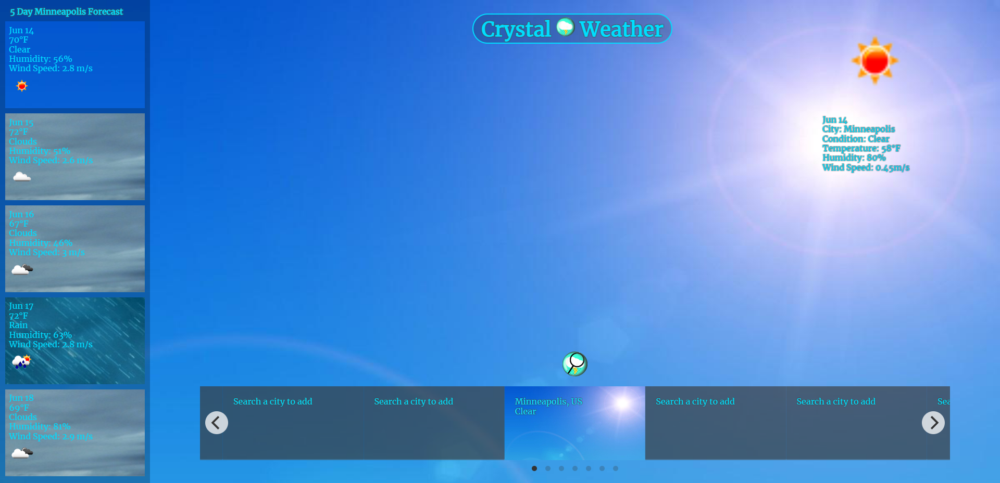
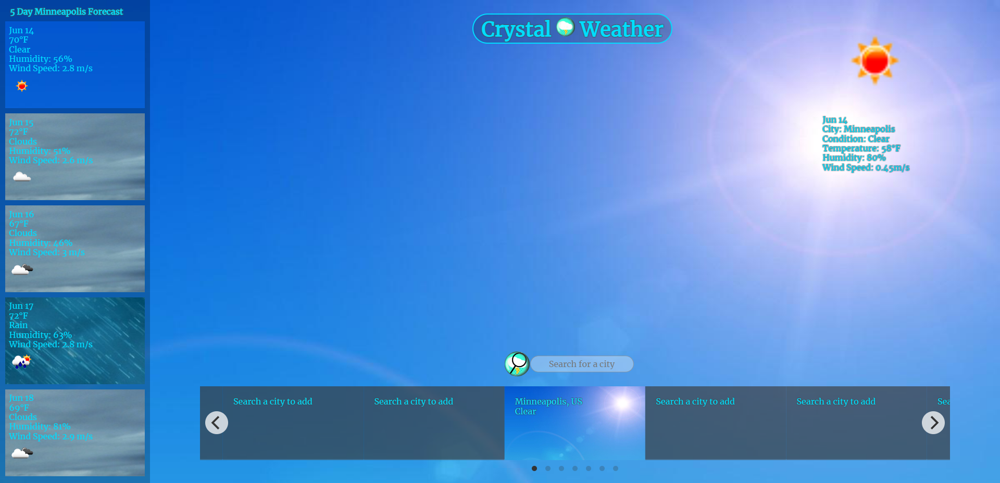
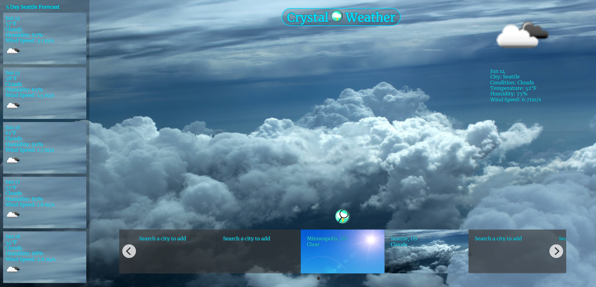

# Crystal-Weather
## Description

Crystal Weather is a fun little app I made to browse the weather forecasts in whatever areas you would like! Just use the search button at the bottom to 
see what the weather is in a particular area, and it will automatically be added to your saved gallery on the bottom of the page, which you can navigate by clicking through the carousel. Crystal weather features animations, background transitions, and a nice theme, as well as a 5 day forecast for the currently selected city. It has a lot of vivid background images for a variety of different weather conditions, including:

Cloudy
Clear
Rain
Snow
Drizzle
Thunderstorm
Mist
Smoke
Haze
Dust
Fog
Sand
Ash
Squall, 
and Tornado
## Table of Contents

- [Usage](#usage)
- [Credits](#credits)
- [License](#license)
- [Features](#features)

## Usage

Head on over here to check out the page ==> [Scheduler App](https://ikonicres.github.io/Crystal-Weather)    

I worked hard to make the app as simple and elegant as possible:  

The app has a pleasing set of background images that appear on the gallery, the page background, and the forecast cards. I made a favicon to round out the page, and added a nice transition animation that overlays clouds for a few seconds. Using the search button on the bottom of the page, the user can enter any city with country code they would like (e.g. Houston, US), and the city gets added to their gallery at the bottom. The gallery is saved to local storage to persist through uses, and clicking one of the saved cities on the bottom carousel changes the info and backgrounds on the page to that city's. The main page displays an icon of the current weather condition, date, city name, weather condition, temp, humidity and wind speed. The 5 day forecast displays much of the same info, but contains a mode of each throughout the day. 

  
All in all I had a lot of fun making this so please have a lot of fun using it! 

  

## Credits

Who needs sleep?

## License

The MIT License (MIT)

Copyright (c) 2023 Michael Ikonomou

Permission is hereby granted, free of charge, to any person obtaining a copy of this software and associated documentation files (the "Software"), to deal in the Software without restriction, including without limitation the rights to use, copy, modify, merge, publish, distribute, sublicense, and/or sell copies of the Software, and to permit persons to whom the Software is furnished to do so, subject to the following conditions:

The above copyright notice and this permission notice shall be included in all copies or substantial portions of the Software.

THE SOFTWARE IS PROVIDED "AS IS", WITHOUT WARRANTY OF ANY KIND, EXPRESS OR IMPLIED, INCLUDING BUT NOT LIMITED TO THE WARRANTIES OF MERCHANTABILITY, FITNESS FOR A PARTICULAR PURPOSE AND NONINFRINGEMENT. IN NO EVENT SHALL THE AUTHORS OR COPYRIGHT HOLDERS BE LIABLE FOR ANY CLAIM, DAMAGES OR OTHER LIABILITY, WHETHER IN AN ACTION OF CONTRACT, TORT OR OTHERWISE, ARISING FROM, OUT OF OR IN CONNECTION WITH THE SOFTWARE OR THE USE OR OTHER DEALINGS IN THE SOFTWARE.

## Features

-Saves searched cities to local storage, for later navigation.
-Changes background with fade, and fires cloud animation on transition.
-Auto capitalizes the users input before saving, and removes any potential numbers or symbols before searching.
-Has cool theme and makes eyes happy
-Fully commented/cleaned and written making it easy to read and modify

